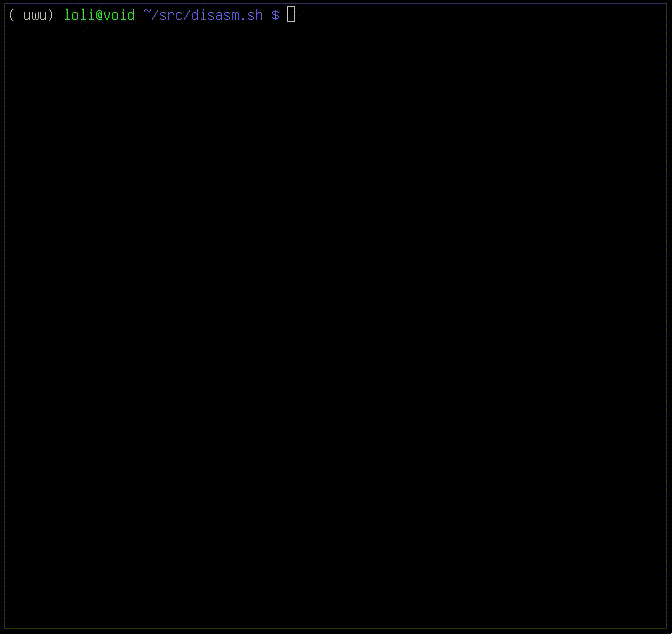

live disassembler in vim similar to compiler explorer

# dependencies
* objdump
* vim

# usage
`./disasm.sh some_file.c`

disassembly output is refreshed every time you edit and save the code

supported environment vars:

* `CFLAGS`: compiler flags defaults to `-O0 -gdwarf-2 -fno-stack-protector`
* `ODFLAGS`: objdump flags defaults to
  `--disassembler-options=intel --source`
* `CC`: compiler binary (must be compatible with gcc-like params -c and -o).
  defaults to gcc
* `TIMEOUT`: maximum runtime for the binary, defaults to 1 (second)
